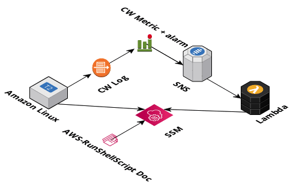

# SSM Automation


The purpose of this activity is to familiarize yourself with:

* Linux shell scripting
* Amazon CloudWatch Logs Agent
* CloudWatch Logs + Filters
* CloudWatch Alarm thresholds
* Lambda
* SSM Run Document


## Spec



* Create an IAM role assumable by an EC2 instance with the managed policy `AmazonEC2RoleforSSM` attached.
* Launch an EC2 instance based on Amazon Linux 2 that you can shell into (session manager will do, or ssh, up to you). Add **at least** the tag of `role` key with a value of `ssm-automation`.
* Install the [CloudWatch agent](https://docs.aws.amazon.com/AmazonCloudWatch/latest/logs/QuickStartEC2Instance.html) onto the machine. Configure it to publish the logs into the same region that the instance was launched within.
* Write a shell script that writes to a dedicated log file for this shell script on the system every 60 seconds. **More details about the contents down below!**
* Write a wrapper for the above script to be run as a systemd daemon process. See reference guide below on a tip where to find an example.
* Configure AWS CloudWatch logs agent to forward the output from the above script log to CloudWatch
* Create a CloudWatch Metric Filter on your log stream that searches for the "okay" message.
* Create a CloudWatch Alarm threshold based on the "okay" filter that when in missing data state to send a message to a SNS topic (that you create). This should be done so that it activates as quickly as possible.
* Create a Python Lambda function that triggers the SSM document `AWS-RunShellScript` to restart the service written targeting your instance using `systemctl restart` against your service name. Refer to references on how to write this, combine your knowledge from the [Hello World Lambda code](https://bitbucket.org/corpinfo/top-training-material/src/master/serverless-hello-world/lambda/index.py) we wrote.
* Configure the SNS topic to invoke the above lambda function

### Shell script log entries

Your shell logging script should pull some information about your system and post it in along with its log line. These values should be evaluated at runtime (not hard coded).

* Hostname
* Kernel release
* The number of megabytes of free RAM
* Free number of inodes for the root volume
* Number of open file handles
* append the word "okay" at the end

Here is a sample log entry line:

```
ip-10-132-121-216.us-west-2.compute.internal: kernel=4.14.243-185.433.amzn2.x86_64 megs_free=315 free_inodes=52364752 files_open=38560 status=okay
```

## Test it

Stop your service on the EC2 instance from generating log entries. Ensure that the process is automatically restarted through the automation infra.


## Resources

* For Linux systemctl scripts refer to the userdata within [imgmgr-cfn.json](https://bitbucket.org/corpinfo/top-training-material/src/master/img-mgr-lb-with-cdn/imgmgr-cfn.json)
* Using boto3/SSM to [run documents](https://stackoverflow.com/questions/34028219/how-to-execute-commands-on-aws-instance-using-boto3/41385070) on machines
* [Hello World Lambda code](https://bitbucket.org/corpinfo/top-training-material/src/master/serverless-hello-world/lambda/index.py)
* [JSON Decode Online](https://codebeautify.org/json-decode-online)
